# Практикум по программированию 2 семестр
Автор Фазлыев Р. Пи20-6

1. Алгоритмы асимметричного шифрования
2. Низкоуровневая работа с веб
3. FTP сервер
4. Создание микросервиса

# 1.Алгоритмы асимметричного шифрования

Модифицируйте код клиента и сервера так, чтобы приватный и публичный ключ хранились в текстовых файлах на диске и, таким образом, переиспользовались между запусками.                             
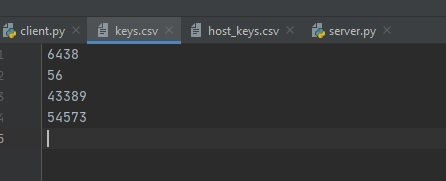
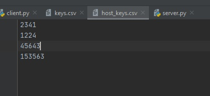

Реализуйте на сервере проверку входящих сертификатов. На сервере должен храниться список разрешенных ключей. Когда клиент посылает на сервер свой публичный ключ, сервер ищет его среди разрешенных и, если такого не находит, разрывает соединение. Проверьте правильность работы не нескольких разных клиентах.
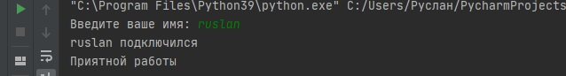
 Модифицируйте код клиента и сервера таким образом, чтобы установление режима шифрования происходило при подключении на один порт, а основное общение - на другом порту. Номер порта можно передавать как первое зашифрованное сообщение.

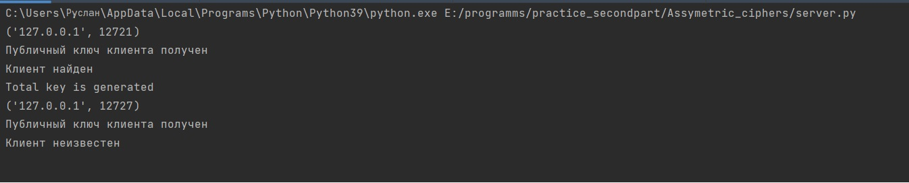

# 2. Web-сервер

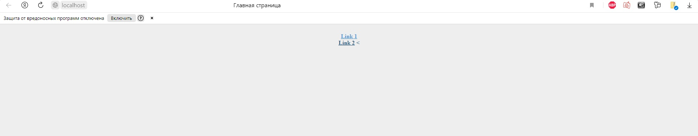

Дополнительные задания
При ответе вашего сервера посылайте некоторые основные заголовки:
Date
Content-type
Server
Content-length
Connection: close.

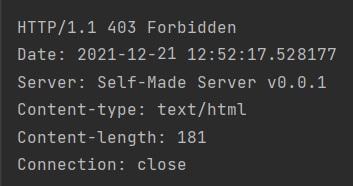                                                         

Сервер должен вести логи в следующем формате: Дата запроса. IP-адрес клиента, имя запрошенного файла, код ошибки
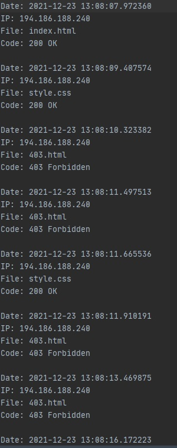

Создайте файл настроек вашего веб-сервера, в котором можно задать прослушиваемый порт, рабочую директорию, максимальный объем запроса в байтах. Можете добавить собственные настройки по желанию.

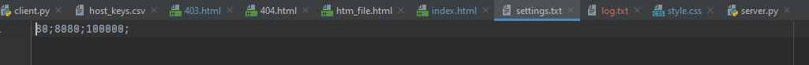

Если файл не найден, сервер передает в сокет специальный код ошибки - 404.
Сервер должен вести логи в следующем формате: Дата запроса. IP-адрес клиента, имя запрошенного файла, код ошибки.
Реализуйте поддержку бинарных типов данных, в частночти, картинок.
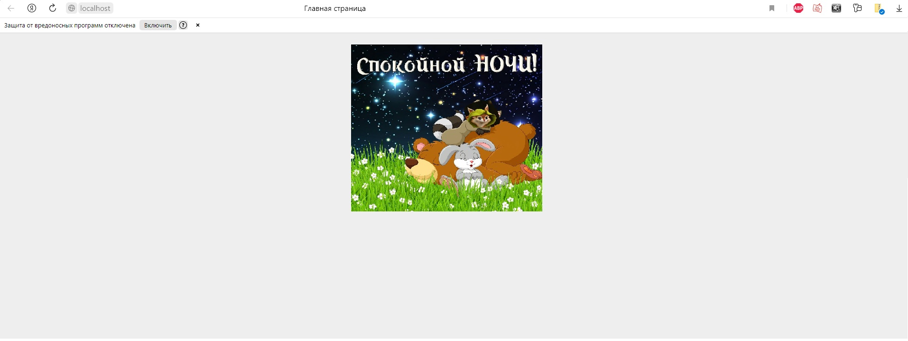

# 3. FTP сервер

Рекомендуется использовать следующий набор команд:

Посмотреть содержимое папки;
Создать папку;
Удалить папку;
Удалить файл;
Скопировать файл с клиента на сервер и наоборот;
Выход (отключение клиента от сервера);
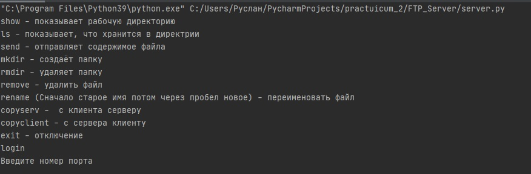
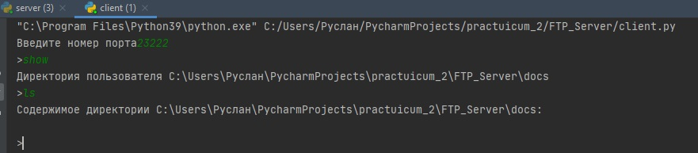                                                                                               
Создание и удаление папки из нашей дириктории.
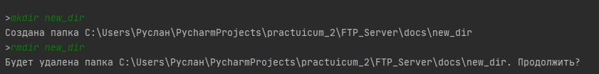                                                          
Выход (отключение клиента от сервера);                                                                                  
                                                                                         
Ограничьте возможности пользователя рамками одной определенной директории. Внутри нее он может делать все, что хочет: создавать и удалять любые файлы и папки. Нужно проследить, чтобы пользователь не мог совершить никаких действий вне пределов этой директории. Пользователь, в идеале, вообще не должен догадываться, что за пределами этой директории что-то есть.                                                                       
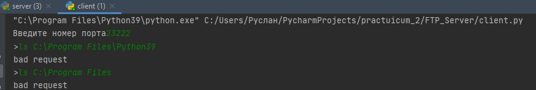                                                                 
Добавьте логирование всех действий сервера в файл. Можете использовать разные файлы для разных действий, например: подключения, авторизации, операции с файлами.
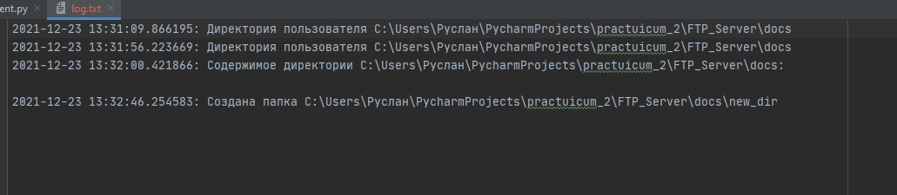                                                  
Реализуйте учётную запись администратора сервера.
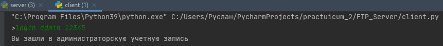

# 4. Создание микросервиса

На основе предложенного шаблона реализуйте сервис, реализующий регистрацию пользователей. Сервис должен поддерживать REST API и коллекцию /user/, хранящую данные о логинах и паролях пользователей, зарегистрированных в системе. Сервис должен принимать и отдавать информацию в формате JSON. Сервис должен хранить следующую информацию про каждого пользователя: логин, хеш пароля (лучше с солью), дату регистрации.
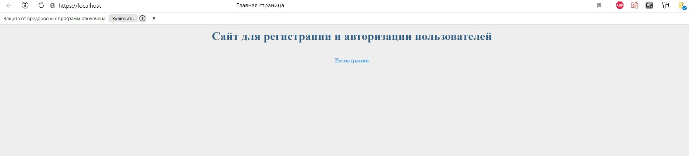
Я использую библиотеку Request она помогает делать различные запросы. когад мы удаляем пользователя, который подключился к серверу нам возвращется пустая строка, если мы создаём разных людей с одинаковыми паролями, то результат будет разынм. Если вы попытаеть узнать информацию об удалённом пользователе то сервер вернёт ошибку.
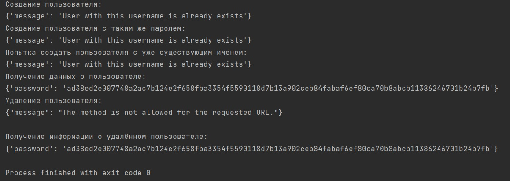               
POST запрос для регистрации
                      
Модифицируйте код вашего сервиса таким образом, чтобы он поддерживал защищенное соединение.
                    
